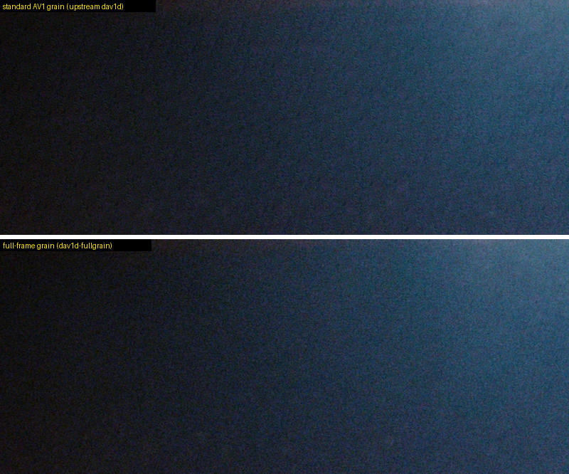
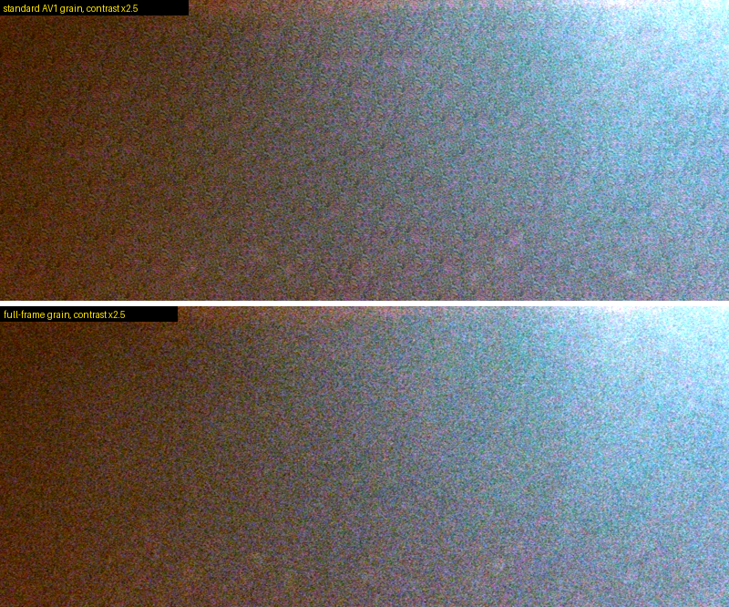
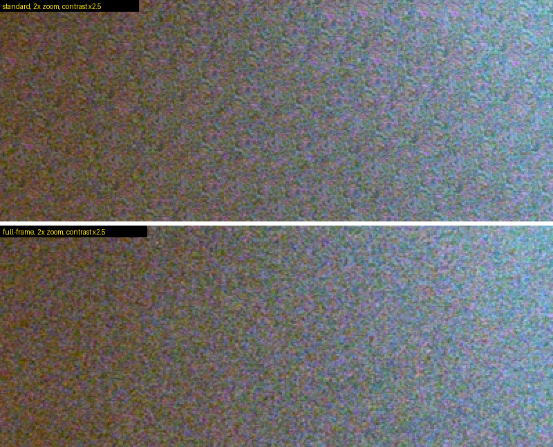
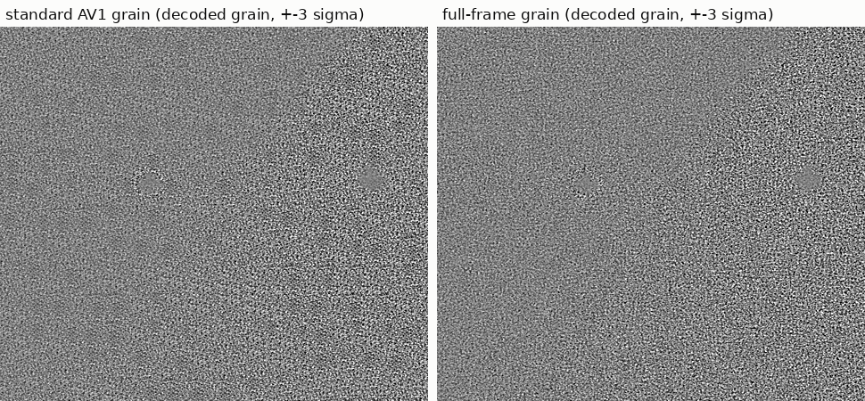
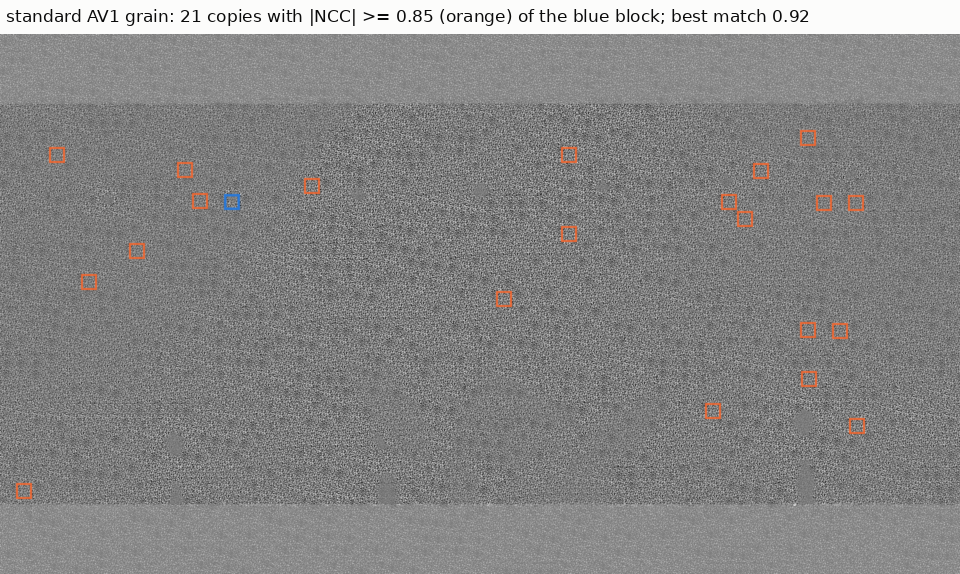
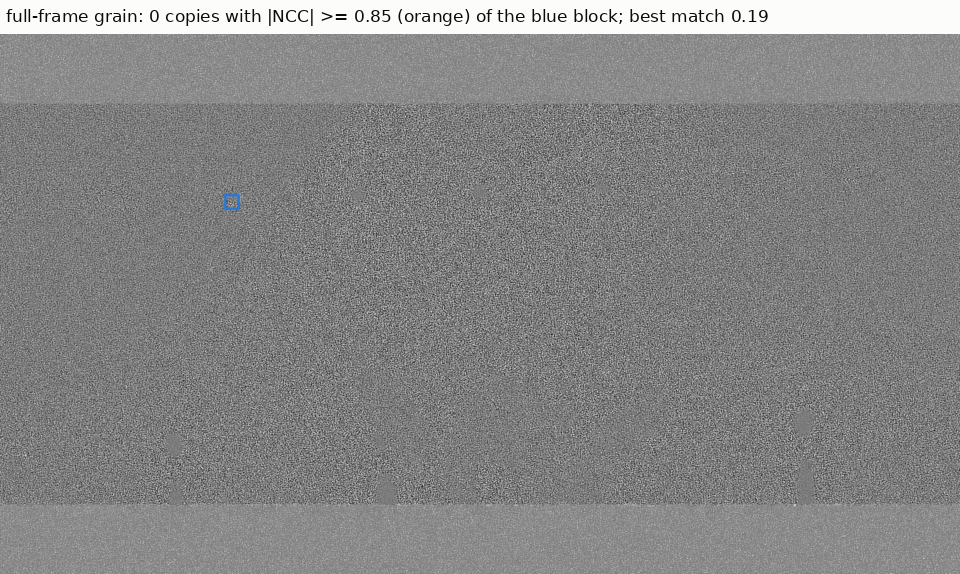
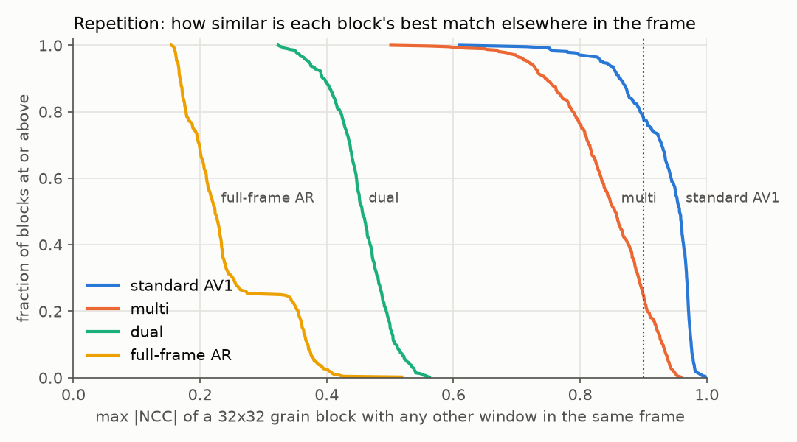
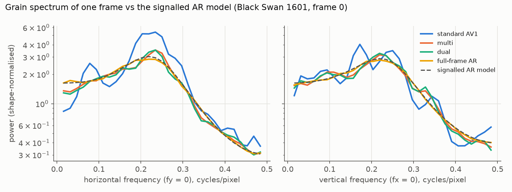
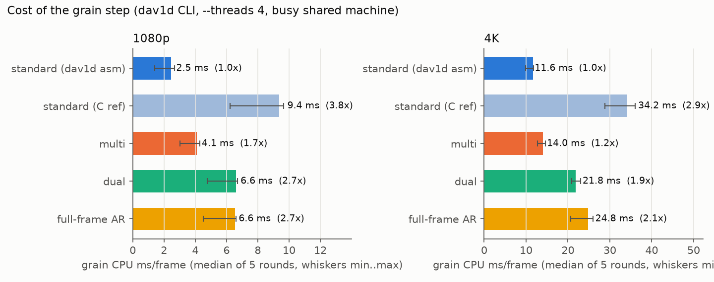

# dav1d-fullgrain

A fork of [dav1d](https://code.videolan.org/videolan/dav1d) 1.5.4, the AV1
decoder used by ffmpeg, mpv and most players. It draws AV1 film grain over the
**whole frame**, instead of tiling one small grain patch over it.

Encoders such as SVT-AV1 and libaom remove film grain before encoding and
send a short grain description instead: an auto-regressive (AR) noise model
and an intensity curve. The decoder synthesises the grain from that
description. The AV1 specification builds it as follows:

- one **82x73** grain template is generated per frame;
- the frame is covered with 32x32 blocks, each copied from one of only **256
  positions** in that template.

The same few thousand grain samples therefore appear hundreds of times in
every frame. On grainy films this shows as a faint repeating texture: diagonal
streaks, a 32-pixel grid, the same speckle in many places. This fork runs the
same signalled AR model over the full frame instead. The grain keeps the
statistics the encoder signalled, with no repeats and no block seams.

The upstream dav1d README is [README.dav1d.md](README.dav1d.md).

## Comparison

A frame from *Black Swan* (stage haze), 1080p 10-bit AV1 with film grain. Both
halves decode the same bitstream with the same grain parameters; only the
synthesis differs. This encode happens to use an unlucky grain seed: its
82x73 template has a visible blotch, and standard AV1 tiles it across the
whole frame. Full-frame synthesis doesn't use a template, so the seed can't
create a pattern.

At 1:1:



Contrast stretched 2.5x, where the repeating tile is easy to see:



Zoomed 2x:



Even with a typical seed, the standard tiling repeats; it's just less obvious
by eye. Below is a second Black Swan stage frame encoded with an ordinary seed.
The grain on its own (decoded with grain minus decoded without), contrast
stretched:



Repetition map. For one 32x32 block of grain (blue), every place elsewhere in
the same frame where the grain matches it with a correlation of 0.85 or more
is outlined in orange:




## Numbers

Measured on four films (two 1080p 10-bit, one 1080p 8-bit, one 4K 10-bit),
8 frames each (4 for the 4K film):

| | standard AV1 | full-frame |
|---|---:|---:|
| 32x32 grain blocks with a near-copy (correlation > 0.9) elsewhere in the same frame | 92-97 % | **0 %** |
| median best match of a block anywhere else in the frame (independent noise: 0.17-0.37) | 0.95-0.97 | **0.17-0.37** |
| per-frame spectrum error against the signalled AR model (dB RMS) | 1.3 | **0.07-0.11** |
| variance ripple with a 32-px period | ±9-11 % | **±1-2 %** (noise floor) |
| grain CPU time vs standard, x86-64 AVX2 (1080p / 4K) | 1x | **2.7x / 2.1x** |
| whole-decode CPU vs standard (1080p / 4K) | | **+49 % / +32 %** |




The spectrum chart shows a single frame. The standard synthesis inherits the
random error of its one small template, so every frame's grain spectrum is
off by about 1.3 dB, differently in each frame. Full-frame grain follows the
signalled model.

Cost was measured with `--threads 4` on a Ryzen 5 9600X under load. The
spread over 5 rounds was 2.3-4.0x at 1080p and 2.1-2.35x at 4K; within each
round the ratio is steadier than the absolute times.



A 4K 10-bit film decodes at 43 fps on 4 threads, against 57 fps for
upstream. On Apple Silicon the NEON code produces identical output (checked
in CI and under qemu), but its speed has not been measured on real hardware
yet; CI prints timings for `macos-14`.

## How it works

**Inputs, all as signalled.** The same 2048-entry Gaussian table and shifts,
the same AR coefficients with the same integer rounding and clipping, the
same piecewise-linear intensity scaling, and the same chroma-from-luma AR
term.

**Full-frame mode.**
- White noise is a stateless hash of the frame seed and the pixel position.
- The AR recursion runs over the whole frame.
- To keep dav1d's parallel row tasks, each band of 4x32 rows restarts the
  recursion 16 rows above itself. Because the noise is a hash, the warm-up
  rows reproduce the rows above, and the restart is invisible: at most 0.7 %
  of the grain RMS in luma.
- SIMD: the AR filter's left-neighbour taps make every row a serial
  dependency chain. 16 rows are therefore computed in lockstep in a skewed
  memory layout, one vector lane per row, where every filter tap is a single
  vector load. This is done in AVX2 on x86-64 and NEON on arm64.
- Results are bit-identical to the C code on both architectures.

**Other modes** come from the same study. They keep the 32x32 blocks but mix
more grain:
- `dual` adds two block layers on grids offset by 16 px.
- `multi` uses 16 templates per frame and per-block sign and 180° rotation.

`dual` removes the strong repeats at about the same cost as `full`. `multi`
is cheaper and only removes exact copies. `full` is the default.

## Install

> **This is not a conformant AV1 decoder.** The AV1 spec defines the grain
> pixel by pixel. With this fork, decoded AV1 *with film grain* differs from
> every other decoder, although the grain is statistically the same. Video
> without film grain is decoded exactly like upstream dav1d. Use it for
> watching, not for conformance tests or anything that compares checksums.
> `DAV1D_GRAIN_MODE=standard` gives standard grain at any time.

The library has the same name, version and API as dav1d 1.5.4
(`libdav1d.so.7` / `libdav1d.7.dylib`). Installed in place of the system
copy, it is picked up by ffmpeg, mpv and everything else that links the
system dav1d. Apps that bundle their own dav1d are not affected: IINA,
mpv.app, VLC and web browsers.

### Arch Linux

This replaces the `dav1d` package system-wide (`provides=dav1d`,
`conflicts=dav1d`):

```sh
git clone https://github.com/divergentnn/dav1d-fullgrain.git
cd dav1d-fullgrain/packaging/arch
makepkg -si
```

Back to stock: `sudo pacman -S dav1d`. The PKGBUILD runs the test suite in
`check()`. For a different default mode, use
`DAV1D_FULLGRAIN_MODE=dual makepkg -si`.

### Other Linux

```sh
git clone https://github.com/divergentnn/dav1d-fullgrain.git
cd dav1d-fullgrain
meson setup build --buildtype=release --prefix=/usr/local
ninja -C build
sudo ninja -C build install
sudo ldconfig
ldd "$(command -v ffmpeg)" | grep dav1d    # should now point into /usr/local
```

You need `meson`, `ninja` and, on x86, `nasm`. On Debian and Ubuntu,
`/usr/local/lib` is searched before the system library. On distros where it
is not (Fedora, Arch), add the install libdir to `/etc/ld.so.conf.d/` or use
your distribution's packaging. To undo, run
`sudo ninja -C build uninstall && sudo ldconfig`.

**Without installing anything.** Build as above, skip the install, and start
mpv through the wrapper:

```sh
contrib/mpv/mpv-fullgrain FILE.mkv           # or: mpv-fullgrain standard|dual|multi FILE
```

### macOS (Homebrew)

```sh
git clone https://github.com/divergentnn/dav1d-fullgrain.git
cd dav1d-fullgrain
packaging/macos/install.sh
```

The script:
- installs `meson` and `ninja` with Homebrew (`nasm` on Intel);
- builds the fork and runs the tests;
- swaps the `libdav1d.7.dylib` inside Homebrew's `dav1d` keg (keeping the
  original as `libdav1d.7.dylib.stock`) and re-signs it.

Homebrew's ffmpeg and mpv (`brew install mpv`) then use the fork. To undo,
run `packaging/macos/uninstall.sh` or `brew reinstall dav1d`.

`brew upgrade dav1d` also puts the stock library back; run `install.sh`
again afterwards, or `brew pin dav1d`. The script refuses to replace a
Homebrew dav1d other than 1.5.x unless you run it with `FORCE=1`.

**Without touching Homebrew.** Build with `meson setup build && ninja -C build`,
then use `contrib/mpv/mpv-fullgrain FILE`, which sets `DYLD_LIBRARY_PATH` for
Homebrew's mpv.

### mpv settings (Linux and macOS)

The fork only matters when dav1d decodes the AV1.

- **Grain on the GPU: handled.** mpv's `gpu-next` renderer normally asks the
  decoder to leave grain out and draws standard AV1 grain itself
  (`vd-lavc-film-grain=auto`). The fork still applies full-frame grain in that
  case and hides the grain parameters, so nothing is drawn twice. This is the
  `grain_force` option, on by default; `DAV1D_GRAIN_FORCE=0` restores the
  upstream behaviour.
- **Hardware decoding: needs one line.** With hardware decoding, dav1d isn't
  used at all. That applies to Macs with M3 or later and to most recent PC
  GPUs, if mpv's `hwdec` is on. Keep AV1 in software and everything else in
  hardware with this line in `~/.config/mpv/mpv.conf`:

```ini
# AV1 in software (dav1d); every other codec keeps hardware decoding
hwdec-codecs=h264,vc1,hevc,vp8,vp9,prores,prores_raw,ffv1,dpx
```

That list is mpv 0.41's default without `av1`. The file is also at
[contrib/mpv/mpv.conf](contrib/mpv/mpv.conf).

**Live A/B.** Load [contrib/mpv/grain-mode.lua](contrib/mpv/grain-mode.lua)
(the wrapper does this; with a system install, set `DAV1D_GRAIN_MODE_FILE`
to any writable path before starting mpv):
- `g` cycles standard / dual / full / multi;
- `b` is a blind toggle between standard and full, shown only as A/B;
- `B` reveals which was which.

## Options

| | |
|---|---|
| `DAV1D_GRAIN_MODE=full\|standard\|dual\|multi\|standard_c` | override the default mode at runtime; `standard` = conformant AV1 grain |
| `DAV1D_GRAIN_MODE_FILE=path` | re-read the mode from this file while decoding (every 100 ms) |
| `DAV1D_GRAIN_STATS=1` | print grain CPU time per frame when the decoder closes |
| `DAV1D_GRAIN_SIMD=0` | use the C paths (testing) |
| `DAV1D_GRAIN_TEMPLATES`, `DAV1D_GRAIN_WARMUP`, `DAV1D_GRAIN_BANDS` | tuning for multi/dual (16) and full (16 rows, 4 bands) |
| meson `-Dgrain_mode_default=full\|standard\|dual\|multi` | built-in default (`full` in this fork) |
| `DAV1D_GRAIN_FORCE=0\|1`, meson `-Dgrain_force=true\|false` | apply the variant even when the player turned grain off, hiding the grain parameters from it (default on; off = upstream behaviour) |

## Caveats

- **Non-conformant on purpose** (see above). Anything that applies AV1 grain
  outside dav1d still shows standard grain: hardware decoders, mpv's
  `gpu-next` grain, browsers.
- **Software decoding of AV1 costs CPU.** Full-frame grain adds about 30-50 %
  to dav1d's decode time.
- **x86-64 uses AVX2; arm64 uses NEON.** Other CPUs use portable C, which is
  correct but several times slower for `full`; `dual` is the lighter choice
  there.
- **Statistics, not pixels.** The grain matches the signalled statistics,
  not the grain of the original film: that information was never in the
  file.

## Testing

`tests/fullgrain/run.sh build/tools/dav1d [upstream/dav1d]` checks:
- every mode against committed hashes, which are identical on x86-64 and
  arm64;
- the SIMD paths against the C paths;
- given an upstream dav1d 1.5.4 build, that `standard` is md5-identical to it.

The test streams are synthetic, made with aomenc's film-grain test vectors.
[CI](.github/workflows/fullgrain.yml) runs this on Linux x86-64 and macOS
arm64.

## Licence and credits

dav1d is © VideoLAN and dav1d authors, under the BSD 2-Clause licence
([COPYING](COPYING)). This fork's changes are released under the same
licence. The film-grain test streams are synthetic. The comparison images
are small crops from *Black Swan* (2010), used here for illustration.
